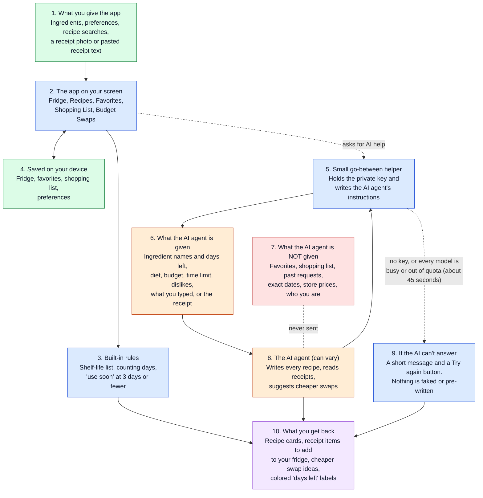

# How VeggieFridge works: a picture for non-technical readers

This page shows how information moves through the prototype: what goes in, which parts always behave the same way, which part uses AI and can vary, and what you get back.

**How to read the colors**

- **Green:** information coming in, or saved.
- **Blue:** parts that always behave the same way. Give them the same input and you get the same result.
- **Orange:** the AI agent and what it is given. Its answers can be different each time, and can be wrong.
- **Red:** information the AI agent never sees.
- **Purple:** what you get back.
- **Dotted lines:** paths that only happen sometimes.

## The walkthrough

1. **You give the app some information.** You type in ingredients, choose preferences, search for a dish, or upload a receipt photo (or paste its text).
2. **The app keeps it on your device.** Your fridge, favorites, shopping list and preferences are saved in your own browser. There are no accounts.
3. **The built-in parts do the everyday work themselves, the same way every time.** The app looks up how long each food usually lasts, counts the days, and flags anything with 3 days or fewer left. No AI is involved in any of this. The app has no pre-written recipes.
4. **When you open the Recipes tab or ask for more recipes, the app hands the job to the small go-between helper.** The same goes for a receipt reading or a cheaper swap. The helper is the only part that holds the private key to Google's AI. It writes the AI agent's instructions and sends them along with the information listed in box 6.
5. **The AI agent does its one job and answers.** It writes four vegetarian recipes, or picks the vegetarian items off a receipt, or suggests cheaper substitutes. Each request stands alone: the agent has no memory of earlier ones and cannot take actions. The one thing it could do, only when writing recipes, is search Google for real recipes to base each one on. **This is currently switched off** because the free Gemini key has no allowance for it, so recipes show as AI-written with no credits. It then names the original website and creator on each recipe card, with a link. The recipe steps are still Gemini's own short summary, not a copy. If Google Search isn't available, the recipes are written without it and the screen says they have no credits.
6. **If the AI can't answer, you are told.** That happens when the key is missing, or Gemini fails to answer. Before giving up, the helper tries up to four different Gemini models in turn, because each has its own small free allowance and any of them can be busy. That takes up to about 45 seconds. The screen shows a short message, and you can try again. Nothing is faked: there are no pre-written recipes, receipt items or swap results to fall back on.
7. **You get results back.** These include recipe cards that say whether you can cook now or what is missing, receipt items you can tick and add to your fridge, and swap ideas.

## What the AI agent is given, and what it isn't

| Job | Given | Not given |
|---|---|---|
| **New recipes** | Your ingredient names, quantities and days left (with "expiring soon" flagged), your diet, budget style, longest cooking time, favorite cuisines, dislikes and allergies, whatever you typed in the recipe search (or the ingredients you selected), whether you asked to "rescue" expiring food, and, when you ask for 4 more recipes, a short description of the recipes already on screen (names, cuisine, main ingredients) so it does not repeat them; Google Search may also see the ingredient names inside the searches the AI makes | Your favorites, your shopping list, past requests or answers, exact expiry dates, storage tips, store prices, or anything about who you are |
| **Reading a receipt** | Only the receipt photo (shrunk on your device first) or the pasted text | Everything about your fridge, favorites and preferences |
| **Cheaper swaps** | Only the ingredient you typed | Everything else |

**Privacy note:** because of this, your ingredient list, or your receipt photo, is sent to Google's AI whenever those features are used.

## What always behaves the same, and what can vary

- **Always the same (blue):** the shelf-life list, the day counting and "use soon" labels, the six built-in swap ideas, the shopping list, and saving to your device.
- **Can vary (orange):** every recipe, the receipt reading and the swap search (including the savings percentages, which are guesses). Nobody checks the AI's answers. It is only *asked* to keep recipes vegetarian and to respect your diet and dislikes, and nothing double-checks that it did. Do not rely on it for allergies.

## What runs where

- **Recipes, receipt scanner and swap search:** each has its own small helper on Vercel, so the live site can ask Gemini. All three use the same Gemini key, which has to be added to the Vercel project. Without it, each screen says the AI helper isn't set up yet.
- **Receipt photos** are shrunk on your device first so they upload quickly.
- **Built-in swaps:** the six starter swap ideas are always shown, whether or not the AI works.
