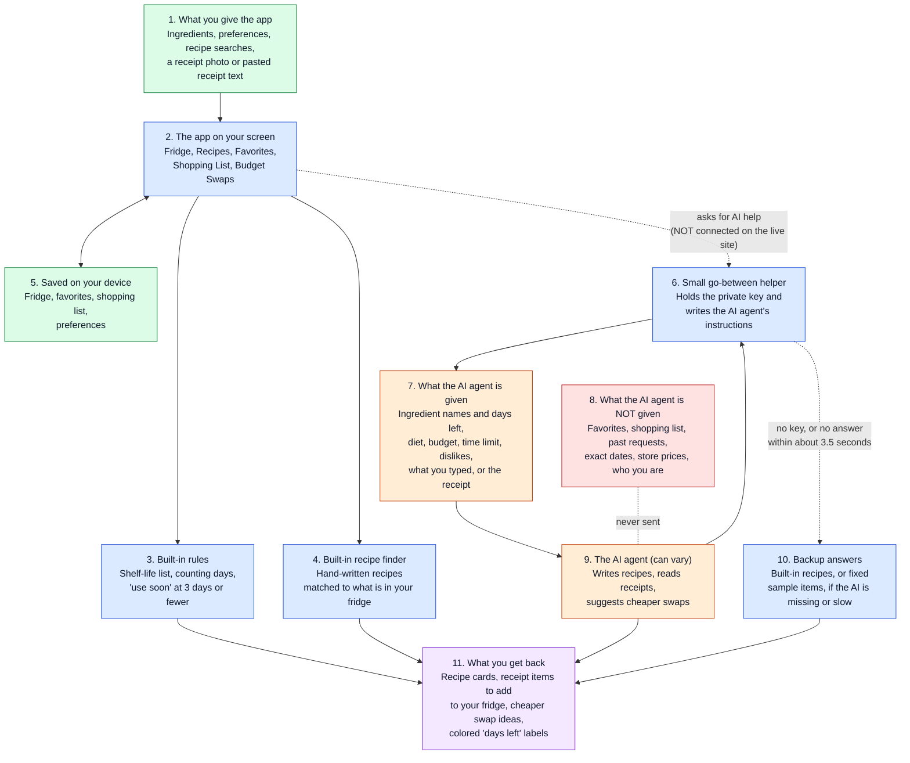

# How VeggieFridge works: a picture for non-technical readers

This page shows how information moves through the prototype: what goes in, which parts always behave the same way, which part uses AI and can vary, and what you get back.

**How to read the colors**

- **Green:** information coming in, or saved.
- **Blue:** parts that always behave the same way. Give them the same input and you get the same result.
- **Orange:** the AI agent and what it is given. Its answers can be different each time, and can be wrong.
- **Red:** information the AI agent never sees.
- **Purple:** what you get back.
- **Dotted lines:** paths that only happen sometimes. The dotted line to the go-between helper does not work on the live site (see below).

## The walkthrough

1. **You give the app some information.** You type in ingredients, choose preferences, search for a dish, or upload a receipt photo (or paste its text).
2. **The app keeps it on your device.** Your fridge, favorites, shopping list and preferences are saved in your own browser. There are no accounts.
3. **The built-in parts do the everyday work themselves, the same way every time.** The app looks up how long each food usually lasts, counts the days, and flags anything with 3 days or fewer left. Its hand-written recipe finder compares recipes with your fridge and lists what is missing. No AI is involved in any of this.
4. **When you ask for fresh recipe ideas, a receipt reading, or a cheaper swap, the app hands the job to the small go-between helper.** The helper is the only part that holds the private key to Google's AI. It writes the AI agent's instructions and sends them along with the information listed in box 7.
5. **The AI agent does its one job and answers.** It writes four vegetarian recipes, or picks the vegetarian items off a receipt, or suggests cheaper substitutes. Each request stands alone: the agent has no memory of earlier ones, cannot take actions, and cannot look anything up.
6. **If the AI can't answer, backup answers step in.** That happens when the key is missing or the AI takes longer than about 3.5 seconds on a recipe request. You get the built-in recipes instead. (Receipts and swaps fall back to a few fixed sample items.)
7. **You get results back.** These include recipe cards that say whether you can cook now or what is missing, receipt items you can tick and add to your fridge, and swap ideas.

## What the AI agent is given, and what it isn't

| Job | Given | Not given |
|---|---|---|
| **New recipes** | Your ingredient names, quantities and days left (with "expiring soon" flagged), your diet, budget style, longest cooking time, favorite cuisines, dislikes and allergies, whatever you typed in the recipe search (or the ingredients you selected), and whether you asked to "rescue" expiring food | Your favorites, your shopping list, past requests or answers, exact expiry dates, storage tips, store prices, or anything about who you are |
| **Reading a receipt** | Only the receipt photo or the pasted text | Everything about your fridge, favorites and preferences |
| **Cheaper swaps** | Only the ingredient you typed | Everything else |

**Privacy note:** because of this, your ingredient list, or your receipt photo, is sent to Google's AI whenever those features are used.

## What always behaves the same, and what can vary

- **Always the same (blue):** the shelf-life list, the day counting and "use soon" labels, the built-in recipes and how they are matched and sorted, the shopping list, and saving to your device.
- **Can vary (orange):** the new recipes, the receipt reading and the cheaper swaps. Nobody checks the AI's answers. It is only *asked* to keep recipes vegetarian and to respect your diet and dislikes, and nothing double-checks that it did. Do not rely on it for allergies.

## The gap on the live site

On the live site, the dotted line from box 2 to box 6 is cut. The small go-between helper isn't running there, so the AI agent is never asked. What visitors get instead:

- **Recipes:** the built-in recipe finder's answers only.
- **Receipt scanner:** an error message.
- **Swap search:** nothing happens (the six built-in swaps still show).
- **Preferences:** the built-in recipe finder ignores them, so they don't change which recipes appear.
